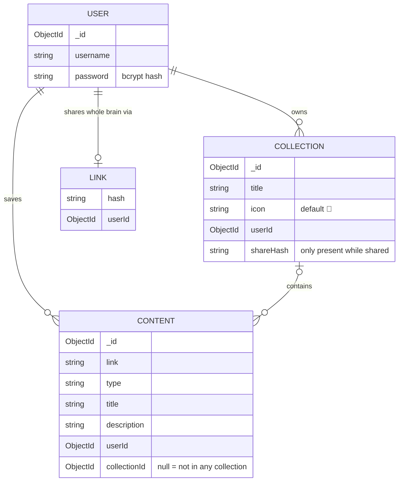
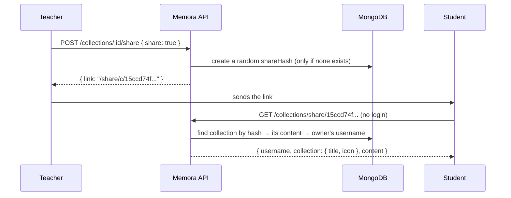

# Memora

**Memora is a "second brain" for links.** Save the YouTube videos, tweets, articles and PDFs you want to keep in one place, sort them into collections, and share a whole collection with anyone through a single link.

---

## Why Memora

Useful links end up scattered across browser bookmarks, chat messages and "watch later" lists. When you need them again, or want to hand them to someone else, they are hard to find.

Memora gives every link a home:

- **Save** anything with a link: a video, a tweet, an article, a PDF.
- **Organise** it into collections, like folders in Notion.
- **Share** one collection, or everything you have saved, with a public link. Viewers don't need an account.

### Example: a teacher sharing notes with a class

> Ms. Sharma teaches Class 5 and Class 6.
>
> 1. She creates two collections: **📘 Class 5** and **📗 Class 6**.
> 2. She saves a YouTube video on fractions and a PDF worksheet into **Class 5**.
> 3. She clicks **Share** on Class 5 and sends the link to the class group.
> 4. Students open the link and see **only Class 5's material**: no login, and nothing from Class 6.
> 5. At the end of the term she turns sharing off, and the old link stops working immediately.

The same flow works for a study group, a team's onboarding resources, or a personal reading list.

---

## Features

| Feature | Description |
|---|---|
| Accounts | Sign up and sign in with a username and password. Passwords are hashed with bcrypt, and sessions use JWT. |
| Save content | Save YouTube videos, tweets, articles, PDFs and other links, with a title and an optional description. |
| Link previews | The app fetches a page's title, description, image and favicon so cards look rich. |
| Collections | Group content into named collections, each with an emoji icon. Rename or delete them at any time. |
| Move content | Move a note into a collection, between collections, or back to "All content". |
| Share a collection | Get a public link for one collection. Sharing again returns the same link, and turning it off revokes the link. |
| Share your whole brain | Get one public link to everything you have saved. |
| Save someone's brain | While viewing a shared brain, save it to your own vault so you can open it later. |
| No duplicates | The same link can't be saved twice in the same place, but it can be in different collections. |
| Dashboard | Search, filter by type, light and dark theme, and toast notifications. |

---

## How it works

### The four building blocks

| Block | What it is | Example |
|---|---|---|
| **User** | A person with an account. | `admin` |
| **Content** | One saved link (a "memory"). | "India vs Australia" (YouTube) |
| **Collection** | A named group of content owned by one user. | 📘 Class 5 |
| **Share link** | A secret, random URL that lets anyone view something read-only. | `/share/c/15ccd74ff616448dd289` |

### How they relate



In words:

- A **user** owns many **collections** and many pieces of **content**.
- Each piece of content belongs to **at most one** collection. When `collectionId` is `null`, the note sits in **"All content"**.
- The **child stores the parent's id**: content stores `collectionId`, and a collection stores `userId`. Moving a note therefore means changing a single field.
- A collection is shared through its own `shareHash`. The whole brain is shared through the `Link` model, which allows one link per user.

### Content types

`youtube`, `twitter`, `image`, `video`, `article`, `audio`, `pdf`, `shared_brain`

`shared_brain` is a saved link to someone else's shared brain.

---

## Workflows

### 1. Sign up and sign in

```
POST /api/v1/auth/signup   { username, password }   → account created (password hashed with bcrypt)
POST /api/v1/auth/signin   { username, password }   → { token }
```

The frontend stores the token and sends it on every protected request:

```
Authorization: Bearer <token>
```

### 2. How a protected request travels

```
Request → router → authMiddleware → controller → Mongoose model → MongoDB
                        │
                        └─ verifies the JWT and sets req.userId
```

Every database query includes `userId`, for example "delete note X **that belongs to me**". A user can never read or change another user's data, even if they know its id.

### 3. Save a note

```
POST /api/v1/content
{ "link": "https://www.youtube.com/watch?v=...", "type": "youtube", "title": "Fractions explained" }
```

The note is saved in "All content" (`collectionId: null`). If the same user has already saved the same link in the same place, the request is rejected with `400 "You have already saved this link to your vault."`

### 4. Organise into a collection

```
POST  /api/v1/collections                  { "title": "Class 5", "icon": "📘" }   → creates the collection
PATCH /api/v1/content/<noteId>             { "collectionId": "<classId>" }        → moves the note in
```

`updateContent` reads `collectionId` in one of three ways:

| You send | Meaning |
|---|---|
| *(nothing)* | Leave the note where it is. For example, editing only the title doesn't move it. |
| `null` | Move it back to "All content". |
| `"<collectionId>"` | Move it into that collection. The collection must be yours, otherwise you get `404`. |

### 5. Share a collection



- **Sharing again** returns the **same** link, so links already sent keep working.
- **Turning sharing off** (`{ share: false }`) removes the hash, and the old link returns `404` from then on.
- Share hashes come from `crypto.randomBytes`, so they can't be guessed.
- The public response contains only what a viewer needs. It never includes `userId` or `shareHash`.

### 6. Delete a collection

```
DELETE /api/v1/collections/<id>
```

Deleting a collection **never deletes its notes**. They are first moved back to "All content", and then the collection is removed.

### 7. Share or save a whole brain

```
POST /api/v1/content/share      { share: true }   → { link: "/share/<hash>" }
GET  /api/v1/content/<hash>                        → { username, content }   (public)
```

A visitor who is signed in can save that brain to their own vault as a `shared_brain` item.

---

## API reference

Base URL: `http://localhost:3000/api/v1`

🔒 means the request must include `Authorization: Bearer <token>`.

### Auth

| Method | Endpoint | | Description |
|---|---|---|---|
| POST | `/auth/signup` | | Create an account |
| POST | `/auth/signin` | | Get a JWT |
| GET | `/auth/me` | 🔒 | Profile of the signed-in user |

### Content

| Method | Endpoint | | Description |
|---|---|---|---|
| POST | `/content` | 🔒 | Save a link |
| GET | `/content` | 🔒 | List all of your content |
| PATCH / PUT | `/content/:contentId` | 🔒 | Update the title or description, or move between collections |
| DELETE | `/content/:contentId` | 🔒 | Delete a note |
| GET | `/content/preview/metadata?url=` | 🔒 | Fetch a link preview (title, image, favicon) |
| POST | `/content/share` | 🔒 | Create the whole-brain share link |
| GET | `/content/:shareLink` | | Public view of a shared brain |

### Collections

| Method | Endpoint | | Description |
|---|---|---|---|
| POST | `/collections` | 🔒 | Create a collection `{ title, icon? }` |
| GET | `/collections` | 🔒 | List your collections, newest first |
| PATCH | `/collections/:id` | 🔒 | Rename or change the icon. Only the fields you send are changed. |
| DELETE | `/collections/:id` | 🔒 | Delete it; its notes return to "All content" |
| POST | `/collections/:id/share` | 🔒 | `{ share: true }` returns the link; `{ share: false }` revokes it |
| GET | `/collections/share/:shareHash` | | Public view of a shared collection |

### Status codes

| Code | Meaning |
|---|---|
| `200` / `201` | Success / created |
| `400` | Invalid input: a bad id, an empty title, a wrong type, or a duplicate link |
| `401` | Missing or invalid token |
| `404` | Not found, **or not yours**. Both give the same answer so ids can't be probed. |
| `409` | Moving a note into a collection that already has that link |
| `500` | Server error. Details are logged on the server and never sent to the client. |

---

## Project structure

```
memora/
├── memora-backend/                 Express + TypeScript + MongoDB API
│   └── src/
│       ├── server.ts               connects to MongoDB, starts the server
│       ├── app.ts                  middleware + route mounting
│       ├── config/db.config.ts     Mongoose connection
│       ├── middlewares/
│       │   └── auth.middleware.ts  verifies the JWT, sets req.userId
│       ├── models/                 user, content, collection, link, tags
│       ├── modules/
│       │   ├── auth/               signup, signin, me
│       │   ├── content/            save, list, update, delete, share brain, previews
│       │   └── collection/         create, list, update, delete, share
│       └── utils/hashingLink.util.ts   secure random share hashes
│
└── memora-frontend/memora-fe/      React + Vite + Tailwind
    └── src/
        ├── pages/                  landing, signup, signin, dashboard, sharedPage
        ├── components/ui/          Sidebar, Card, TopBar, modals, toasts
        ├── hooks/useContent.tsx    loads the user's content
        ├── types/                  shared TypeScript types
        └── config.ts               BACKEND_URL
```

---

## Tech stack

| Layer | Tools |
|---|---|
| Frontend | React 19, TypeScript, Vite, Tailwind CSS 4, React Router 7, Axios |
| Backend | Node.js, Express 5, TypeScript, tsx |
| Database | MongoDB (Atlas) with Mongoose 9 |
| Auth | bcrypt (password hashing), jsonwebtoken (JWT) |

---

## Getting started

### Prerequisites

- Node.js 20.19 or newer (required by Vite)
- A MongoDB connection string, for example from a free MongoDB Atlas cluster

### 1. Backend

```bash
cd memora-backend
npm install
```

Create `memora-backend/.env`:

```env
MONGO_URI=mongodb+srv://<user>:<password>@<cluster>/<database>
PORT=3000
JWT_SECRET=<any long random string>
```

Then start it:

```bash
npm run dev
```

The API runs at `http://localhost:3000`.

Keep `PORT=3000`, because the frontend calls that address (`memora-fe/src/config.ts`).

### 2. Frontend

```bash
cd memora-frontend/memora-fe
npm install
npm run dev
```

Open `http://localhost:5173`.

### 3. Try it

1. Sign up and sign in.
2. Add a YouTube link from the dashboard.
3. Create a collection and move the note into it with `PATCH /api/v1/content/<noteId>`.
4. Share the collection, then open the share URL in a private window.

---

## How the project was built

The project grew in small steps, each committed on its own:

| Step | What was added | Why |
|---|---|---|
| 1 | Auth: signup, signin, JWT middleware, `/me` | Every feature depends on knowing who the user is. |
| 2 | Content: save, list, delete | The core idea: a place to keep links. |
| 3 | Whole-brain sharing (`Link` model, public page) | Let others see what you have saved. |
| 4 | Dashboard UI: cards, sidebar, profile menu, landing page | Make it usable without Postman. |
| 5 | `Collection` model | Group content, for example one collection per class. |
| 6 | `collectionId` on content; `link` no longer globally unique | Link a note to a collection, and allow the same link in different places. |
| 7 | Secure share hashes (`crypto.randomBytes`) | Public links must not be guessable. |
| 8 | Collection create / list / update / delete | Manage collections. Deleting one moves its notes back instead of losing them. |
| 9 | Move content via `updateContent` | Put notes into a class, or take them out. |
| 10 | Compound unique index `{ userId, link, collectionId }` | Stop exact duplicates while still allowing the same link in different collections. |
| 11 | Share a collection and view it publicly | The goal of the project: share one class's material with that class only. |

---

## Roadmap

- `POST /content` accepting `collectionId`, to create a note directly inside a collection.
- `GET /content?collectionId=` to list one collection's notes.
- Collections in the dashboard: a sidebar list, a `/dashboard/c/:id` route, a per-collection Share button, and a public `/share/c/:hash` page.
